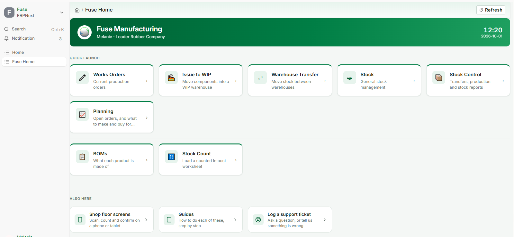
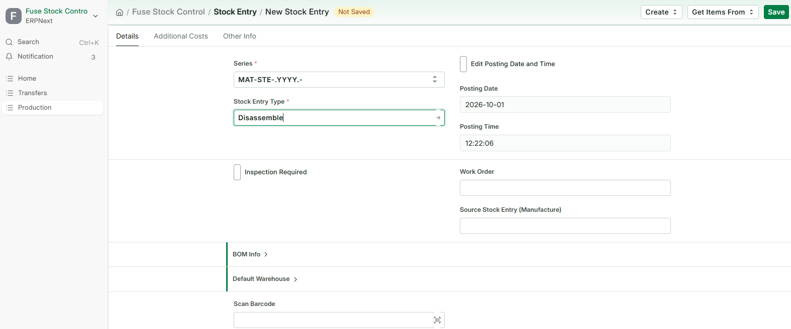
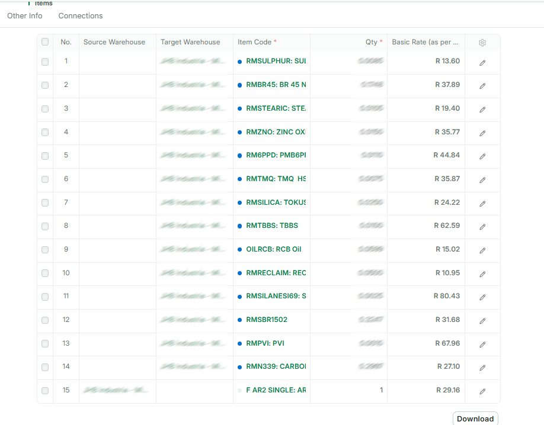
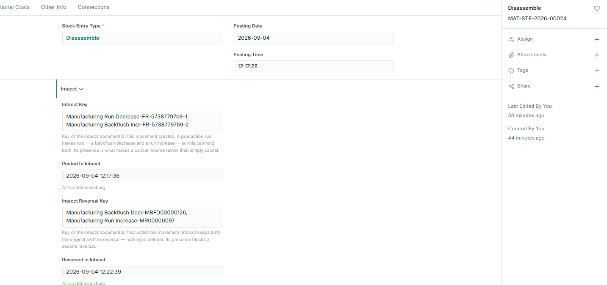

# Disassemble

*Breaking a finished item back into its components — Fuse Manufacturing user guide 19*

> This guide covers **taking a finished item apart** and putting its components back into
> stock. Recording production in the first place is covered in **Works Orders - Recording
> Production**, which also describes this job briefly as part of the works order cycle.

## Before you start

### What disassembling is

A finished item exists in stock, and you are breaking it up. The item leaves stock, and the
components it was made from come back in.

Both halves reach Sage Intacct as a single operation, so an item that has left stock and
become nothing is not possible.

You might do this because an item was built in error, because stock is being reworked,
because a customer cancelled and the parts are worth more than the assembly, or because
components are needed urgently and the quickest source is something already made.

### This is not the same as cancelling a run

They look similar and they are not interchangeable.

**Cancelling a Manufacture entry** undoes one specific production run and puts the works
order back where it was. Use it when you are correcting something you have just recorded.

**A Disassemble entry** is a fresh transaction against stock on hand. There is no run being
undone and no works order involved. Use it when you are breaking up stock.

If you are fixing a run you recorded this morning, cancel it. If you are taking apart stock
that has been sitting in the store for six months, disassemble it.

### Where the components come from

From the **BOM** — the same recipe the item is made by. You choose the item's BOM and how
many you are taking apart, and Fuse works out the components and quantities from it,
exactly as it does for a production run.

BOMs come from Sage Intacct as kits. You never type a recipe in Fuse and you cannot change
one here.

If you happen to know which works order the item originally came from, you can record it,
but it is optional and it changes nothing.

### Before you record anything

- Know which item you are taking apart, how many, and which warehouse they are in.
- Know which warehouse the components are going into.
- Know what you actually recovered — not what the recipe says you should have.
- For lot or serial tracked items, have the lot or serial numbers to hand.

## Recording a disassembly

### Step 1 — Open a new stock entry

1. On Fuse Home, click **Stock Control**, then **Stock Entry**.
2. Add a new one.
3. Set **Stock Entry Type** to **Disassemble**.

### Step 2 — Build it from the BOM

1. Open **BOM Info** and tick **From BOM**.
2. Under **Default Warehouse**, set the **Default Target Warehouse** — where the components
   are going. Every component row picks it up.
3. Choose the **BOM** of the item you are breaking up.
4. Enter the **Finished Good Quantity** — how many you are taking apart.
5. Click **Get Items**.

The components are listed coming in, and the **last row** is the item itself, going out.

### Step 3 — Say where the item is coming from

On that last row, set the **Source Warehouse** — where the item is being taken from.

This is the one warehouse the screen does not fill in for you, and the entry cannot be
submitted without it.

### Step 4 — Bring in the rates

Click **Update Rate and Availability**. Until you do, every rate reads R 0.00, and an entry
with no rates is refused when it posts.

### Step 5 — Correct what actually came back

What the BOM says the item contains and what you actually recover are not always the same.
Something may be damaged, contaminated, or simply not worth keeping.

Correct it on the entry, and it applies to this entry only:

- **Change a quantity** if less came back than the recipe says.
- **Remove a row** — set it to zero or delete it — if a component was not recovered at all.
- **Add a row** if something came out that the recipe does not list.

The master BOM is untouched. Nothing you do here changes the recipe for anyone else.

> **One item per entry**
> Exactly one row leaves stock on a Disassemble entry. If you are taking apart two
> different items, record them as two entries — Fuse has one item's cost to break up per
> entry, not two.

### Step 6 — Submit

1. Click **Save**. It is a draft; nothing has moved.
2. Read the rows once more — the item going out, the components coming in, and the
   quantities.
3. Click **Submit**, and confirm.

Submitting posts to Intacct first. If Intacct rejects it, the entry does not stand and you
will see Intacct's own reason on screen.

## After it is submitted

Two documents reach Intacct, in one operation — the same pair a cancelled production run
uses, because Intacct models it the same way:

- **Manufacturing Run Decrease** — the item leaves stock. No cost is sent; Intacct values
  what leaves at its own costing.
- **Manufacturing Backflush Incr** — the components come back in, **carrying a cost**.

The cost on that second leg is the Fuse rate for each component on the entry: the item's
own value broken back across the parts it yielded. There is no original production run to
read a cost from, and that is the point — taking something apart does not need one.

The item leaves before the components arrive, so the stock never appears in two places at
once.

> **Why a zero cost is refused**
> The components-in definition updates cost in Intacct. Sending a zero would overwrite the
> component's real valuation with nothing. If a row has no rate, Fuse refuses the whole
> entry and names the row rather than posting a destructive number. This is almost always
> **Update Rate and Availability** not having been clicked.

## Common questions

### I need to undo one

Cancel the Disassemble entry. The components go back out and the item comes back in, at the
cost of the components — which is a production run, and it posts through the ordinary
manufacturing pair.

As everywhere else in Fuse: **cancel, never delete**, and never key an opposite entry by
hand. A cancellation is recorded in Intacct as its own reversing pair, so both systems agree
about what happened and when.

### A row has both a source and a destination warehouse

That row reads as a move rather than a disassembly. The item being taken apart has a source
only; the components have a destination only. Clear the warehouse that should not be there.

### It says the entry takes apart more than one item

Only one row may leave stock. Take the second item apart on its own entry — Fuse has one
item's cost to break up, not two.

### It says nothing is taken apart

The item's own row is missing its **Source Warehouse**, so nothing is leaving. Set it on the
last row.

### It says nothing comes back

Every component row has been removed or zeroed. A disassembly has to return the components
it breaks into.

### A rate is zero and the entry is refused

Click **Update Rate and Availability** and submit again. If a component still has no rate,
Intacct holds no cost for it — speak to your supervisor rather than typing one in.

### Not enough stock to take apart

The item is not in the source warehouse in the quantity you entered. Check the warehouse is
right, and check the quantity on hand under **Stock Control**.

### It will not let me submit — posting is switched off

The entry is refused rather than saved. Nothing may move stock without Intacct seeing it,
so an administrator switches posting back on before you record anything.

### No Intacct definition is mapped

Fuse does not know which Intacct document to create. An administrator sets this under
Transactions in Intacct Settings.
